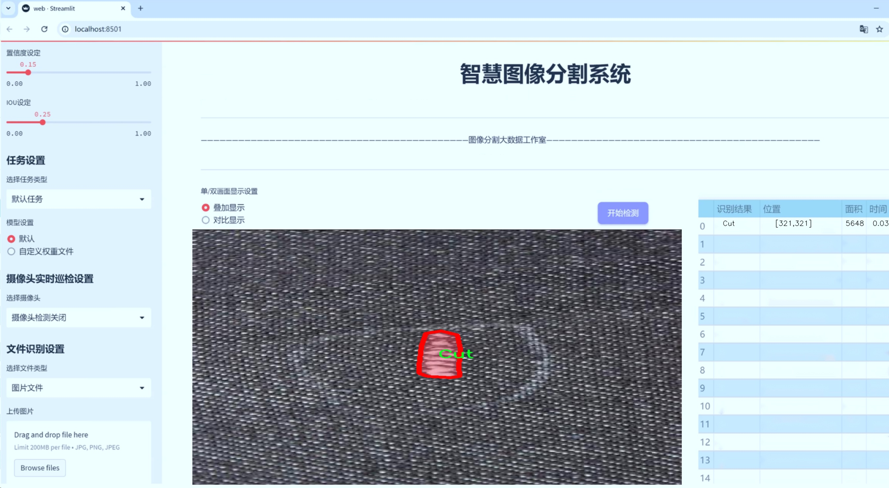

# 织物缺陷分割系统： yolov8-seg-HGNetV2

### 1.研究背景与意义

[参考博客](https://gitee.com/YOLOv8_YOLOv11_Segmentation_Studio/projects)

[博客来源](https://kdocs.cn/l/cszuIiCKVNis)

研究背景与意义

随着全球纺织行业的快速发展，织物质量的提升已成为生产企业面临的重要挑战之一。织物缺陷不仅影响产品的外观质量，还可能导致产品的功能性下降，从而影响消费者的购买决策和品牌形象。因此，及时、准确地检测和分割织物缺陷，成为了现代纺织生产过程中不可或缺的一环。传统的织物缺陷检测方法多依赖人工检查，效率低下且容易受到人为因素的影响，难以满足大规模生产的需求。近年来，计算机视觉和深度学习技术的迅猛发展为织物缺陷检测提供了新的解决方案，尤其是基于卷积神经网络（CNN）的实例分割技术，能够实现对织物缺陷的高效识别和精确定位。

在众多深度学习模型中，YOLO（You Only Look Once）系列模型因其出色的实时检测能力和高准确率而备受关注。YOLOv8作为该系列的最新版本，结合了多种先进的技术，进一步提升了检测性能和速度。然而，针对织物缺陷的特定需求，YOLOv8仍存在一定的改进空间。例如，织物缺陷的种类繁多，形态各异，且在图像中可能与背景相似，导致模型在分割时容易出现误判。因此，基于YOLOv8的改进版本，构建一个专门针对织物缺陷的分割系统，将有助于提高检测的准确性和鲁棒性。

本研究所使用的数据集“demofabricdefect”包含4900张织物图像，涵盖了四类缺陷：切口（Cut）、孔洞（Hole）、污渍（Stain）和线头错误（ThreadError）。这些类别不仅反映了织物在生产和使用过程中可能出现的常见问题，也为模型的训练和评估提供了丰富的样本。通过对这些缺陷进行精确的实例分割，研究者能够更好地理解不同缺陷的特征及其对织物整体质量的影响，从而为后续的改进措施提供数据支持。

本研究的意义在于，通过改进YOLOv8模型，构建一个高效的织物缺陷分割系统，不仅能够提高织物缺陷检测的自动化水平，还能降低人工成本，提升生产效率。此外，该系统的成功应用将为纺织行业的智能化转型提供有力支持，推动相关技术的进一步发展。同时，研究成果也将为其他领域的图像分割任务提供借鉴，具有广泛的应用前景。

综上所述，基于改进YOLOv8的织物缺陷分割系统的研究，不仅具有重要的理论价值，还有助于推动纺织行业的技术进步与创新。通过对织物缺陷的深入分析与高效检测，本研究将为实现高质量纺织品的生产提供坚实的技术基础，促进纺织行业的可持续发展。

### 2.图片演示





注意：本项目提供完整的训练源码数据集和训练教程,由于此博客编辑较早,暂不提供权重文件（best.pt）,需要按照6.训练教程进行训练后实现上图效果。

### 3.视频演示

[3.1 视频演示](https://www.bilibili.com/video/BV1asUbYFExA/)

### 4.数据集信息

##### 4.1 数据集类别数＆类别名

nc: 4
names: ['Cut', 'Hole', 'Stain', 'ThreadError']


##### 4.2 数据集信息简介

数据集信息展示

在本研究中，我们使用了名为“demofabricdefect”的数据集，以训练和改进YOLOv8-seg模型，旨在提升织物缺陷分割系统的性能。该数据集专注于织物缺陷的检测与分类，包含四种主要的缺陷类别，分别为“Cut”（切割）、“Hole”（孔洞）、“Stain”（污渍）和“ThreadError”（线头错误）。这些类别的选择反映了在实际生产和使用过程中，织物可能出现的常见缺陷类型，具有重要的实用价值和研究意义。

数据集的构建经过精心设计，确保了每个类别的样本数量和多样性，以便于模型在训练过程中能够充分学习到各类缺陷的特征。每种缺陷类型都涵盖了不同的实例，确保了模型在面对不同形态和背景的织物时，能够具备良好的泛化能力。例如，“Cut”类别包括了不同深度和形状的切割痕迹，而“Hole”类别则展示了从小孔到大洞的多种情况，帮助模型识别各种尺寸的缺陷。类似地，“Stain”类别涵盖了不同颜色和形状的污渍，而“ThreadError”则展示了不同类型的线头问题，确保模型能够处理各种复杂的织物缺陷。

数据集的标注工作采用了高标准的质量控制流程，确保每个样本的标注准确无误。标注过程中，专业的织物检测人员对每个样本进行了仔细审查，并使用精确的标注工具进行缺陷的定位和分类。这种高质量的标注不仅提高了数据集的可靠性，也为后续的模型训练提供了坚实的基础。

在数据集的使用过程中，我们采用了数据增强技术，以进一步提升模型的鲁棒性和适应性。通过对原始图像进行旋转、缩放、裁剪、翻转等操作，生成了多样化的训练样本，使得模型能够在不同的环境和条件下表现出色。这种数据增强策略有效地扩展了数据集的规模，增强了模型对未知数据的处理能力。

在训练过程中，我们利用YOLOv8-seg模型的强大特性，结合“demofabricdefect”数据集，进行多轮迭代训练。通过不断调整模型参数和优化算法，我们旨在提高模型对织物缺陷的检测精度和分割效果。模型的训练结果将通过交叉验证和测试集评估，确保其在实际应用中的有效性和可靠性。

总之，“demofabricdefect”数据集为我们改进YOLOv8-seg的织物缺陷分割系统提供了丰富的资源和坚实的基础。通过对数据集的深入分析和应用，我们期待能够在织物缺陷检测领域取得突破性进展，为纺织行业的质量控制和生产效率提升做出贡献。


### 5.项目依赖环境部署教程（零基础手把手教学）

[5.1 环境部署教程链接（零基础手把手教学）](https://www.bilibili.com/video/BV1jG4Ve4E9t/?vd_source=bc9aec86d164b67a7004b996143742dc)


[5.2 安装Python虚拟环境创建和依赖库安装视频教程链接（零基础手把手教学）](https://www.bilibili.com/video/BV1nA4VeYEze/?vd_source=bc9aec86d164b67a7004b996143742dc)

### 6.手把手YOLOV8-seg训练视频教程（零基础手把手教学）

[6.1 手把手YOLOV8-seg训练视频教程（零基础小白有手就能学会）](https://www.bilibili.com/video/BV1cA4VeYETe/?vd_source=bc9aec86d164b67a7004b996143742dc)


按照上面的训练视频教程链接加载项目提供的数据集，运行train.py即可开始训练



     Epoch   gpu_mem       box       obj       cls    labels  img_size
     1/200     0G   0.01576   0.01955  0.007536        22      1280: 100%|██████████| 849/849 [14:42<00:00,  1.04s/it]
               Class     Images     Labels          P          R     mAP@.5 mAP@.5:.95: 100%|██████████| 213/213 [01:14<00:00,  2.87it/s]
                 all       3395      17314      0.994      0.957      0.0957      0.0843

     Epoch   gpu_mem       box       obj       cls    labels  img_size
     2/200     0G   0.01578   0.01923  0.007006        22      1280: 100%|██████████| 849/849 [14:44<00:00,  1.04s/it]
               Class     Images     Labels          P          R     mAP@.5 mAP@.5:.95: 100%|██████████| 213/213 [01:12<00:00,  2.95it/s]
                 all       3395      17314      0.996      0.956      0.0957      0.0845

     Epoch   gpu_mem       box       obj       cls    labels  img_size
     3/200     0G   0.01561    0.0191  0.006895        27      1280: 100%|██████████| 849/849 [10:56<00:00,  1.29it/s]
               Class     Images     Labels          P          R     mAP@.5 mAP@.5:.95: 100%|███████   | 187/213 [00:52<00:00,  4.04it/s]
                 all       3395      17314      0.996      0.957      0.0957      0.0845


### 7.50+种全套YOLOV8-seg创新点加载调参实验视频教程（一键加载写好的改进模型的配置文件）

[7.1 50+种全套YOLOV8-seg创新点加载调参实验视频教程（一键加载写好的改进模型的配置文件）](https://www.bilibili.com/video/BV1Hw4VePEXv/?vd_source=bc9aec86d164b67a7004b996143742dc)

### YOLOV8-seg算法简介

原始YOLOV8-seg算法原理

YOLOV8-seg算法是YOLO系列中的最新进展，专注于目标检测与分割任务的高效结合。该算法的设计理念是通过优化网络结构和引入新的技术，提升目标检测的准确性和速度，同时实现对目标的精确分割。YOLOV8-seg的架构主要由三个部分组成：Backbone、Neck和Head，每个部分都在整体性能中扮演着至关重要的角色。

在Backbone部分，YOLOV8-seg采用了一系列先进的卷积和反卷积层，旨在提取图像中的特征信息。与以往的YOLO版本相比，YOLOV8-seg引入了C2模块作为基本构成单元，结合了残差连接和瓶颈结构，以减小网络的复杂度并提高性能。具体而言，Backbone由五个CBS模块、四个C2f模块和一个快速空间金字塔池化（SPPF）模块组成。这样的设计使得网络能够在不同层次上提取丰富的特征信息，从而为后续的目标检测和分割任务打下坚实的基础。

Neck部分则是YOLOV8-seg的特征融合层，它采用了多尺度特征融合技术，将来自Backbone不同阶段的特征图进行有效的融合。这一过程不仅提高了目标检测的性能，还增强了模型对不同尺度目标的鲁棒性。通过将不同层次的特征进行融合，YOLOV8-seg能够更好地捕捉到目标的细节信息，从而在复杂场景中实现更高的检测精度。

Head部分负责最终的目标检测和分割任务。YOLOV8-seg设有三个检测头，分别用于处理不同尺寸的信息。每个检测头都包含一系列卷积层和反卷积层，旨在生成准确的检测结果和分割掩码。与传统的YOLO版本不同，YOLOV8-seg在检测头中引入了轻量化的解耦头，替代了耦合头的设计。这一创新使得模型在处理复杂场景时，能够更灵活地应对目标的多样性和复杂性。

在算法的训练过程中，YOLOV8-seg利用了Pytorch框架的优势，使得自定义模型的训练变得更加方便。该算法的训练过程不仅关注于目标的检测，还同时考虑到目标的分割任务，通过引入交叉熵损失和IoU损失等多种损失函数，确保模型在分割精度和检测精度之间达到良好的平衡。

值得一提的是，YOLOV8-seg的轻量化设计使得其在实际应用中具备了更高的效率。尤其是在移动设备和边缘计算场景中，YOLOV8-seg能够以较低的计算资源消耗，实现实时的目标检测与分割。这一特性使得YOLOV8-seg在智能监控、自动驾驶、医疗影像分析等领域展现出广泛的应用潜力。

综上所述，YOLOV8-seg算法通过优化的网络结构、先进的特征融合技术和轻量化设计，成功地将目标检测与分割任务结合在一起。其在准确性、速度和效率上的显著提升，使得YOLOV8-seg成为当前计算机视觉领域中一个重要的里程碑。随着技术的不断进步，YOLOV8-seg无疑将在未来的研究和应用中发挥更大的作用，推动目标检测与分割技术的进一步发展。


### 9.系统功能展示（检测对象为举例，实际内容以本项目数据集为准）

图9.1.系统支持检测结果表格显示

  图9.2.系统支持置信度和IOU阈值手动调节

  图9.3.系统支持自定义加载权重文件best.pt(需要你通过步骤5中训练获得)

  图9.4.系统支持摄像头实时识别

  图9.5.系统支持图片识别

  图9.6.系统支持视频识别

  图9.7.系统支持识别结果文件自动保存

  图9.8.系统支持Excel导出检测结果数据


### 10.50+种全套YOLOV8-seg创新点原理讲解（非科班也可以轻松写刊发刊，V11版本正在科研待更新）

#### 10.1 由于篇幅限制，每个创新点的具体原理讲解就不一一展开，具体见下列网址中的创新点对应子项目的技术原理博客网址【Blog】：


[10.1 50+种全套YOLOV8-seg创新点原理讲解链接](https://gitee.com/qunmasj/good)

#### 10.2 部分改进模块原理讲解(完整的改进原理见上图和技术博客链接)【如果此小节的图加载失败可以通过CSDN或者Github搜索该博客的标题访问原始博客，原始博客图片显示正常】

### Gold-YOLO简介
YOLO再升级：华为诺亚提出Gold-YOLO，聚集-分发机制打造新SOTA
在过去的几年中，YOLO系列模型已经成为实时目标检测领域的领先方法。许多研究通过修改架构、增加数据和设计新的损失函数，将基线推向了更高的水平。然而以前的模型仍然存在信息融合问题，尽管特征金字塔网络（FPN）和路径聚合网络（PANet）已经在一定程度上缓解了这个问题。因此，本研究提出了一种先进的聚集和分发机制（GD机制），该机制通过卷积和自注意力操作实现。这种新设计的模型被称为Gold-YOLO，它提升了多尺度特征融合能力，在所有模型尺度上实现了延迟和准确性的理想平衡。此外，本文首次在YOLO系列中实现了MAE风格的预训练，使得YOLO系列模型能够从无监督预训练中受益。Gold-YOLO-N在COCO val2017数据集上实现了出色的39.9% AP，并在T4 GPU上实现了1030 FPS，超过了之前的SOTA模型YOLOv6-3.0-N，其FPS相似，但性能提升了2.4%。


#### Gold-YOLO


YOLO系列的中间层结构采用了传统的FPN结构，其中包含多个分支用于多尺度特征融合。然而，它只充分融合来自相邻级别的特征，对于其他层次的信息只能间接地进行“递归”获取。

传统的FPN结构在信息传输过程中存在丢失大量信息的问题。这是因为层之间的信息交互仅限于中间层选择的信息，未被选择的信息在传输过程中被丢弃。这种情况导致某个Level的信息只能充分辅助相邻层，而对其他全局层的帮助较弱。因此，整体上信息融合的有效性可能受到限制。
为了避免在传输过程中丢失信息，本文采用了一种新颖的“聚集和分发”机制（GD），放弃了原始的递归方法。该机制使用一个统一的模块来收集和融合所有Level的信息，并将其分发到不同的Level。通过这种方式，作者不仅避免了传统FPN结构固有的信息丢失问题，还增强了中间层的部分信息融合能力，而且并没有显著增加延迟。


# 8.低阶聚合和分发分支 Low-stage gather-and-distribute branch
从主干网络中选择输出的B2、B3、B4、B5特征进行融合，以获取保留小目标信息的高分辨率特征。


低阶特征对齐模块 (Low-stage feature alignment module)： 在低阶特征对齐模块（Low-FAM）中，采用平均池化（AvgPool）操作对输入特征进行下采样，以实现统一的大小。通过将特征调整为组中最小的特征大小（ R B 4 = 1 / 4 R ） （R_{B4} = 1/4R）（R 
B4 =1/4R），我们得到对齐后的特征F a l i g n F_{align}F align 。低阶特征对齐技术确保了信息的高效聚合，同时通过变换器模块来最小化后续处理的计算复杂性。其中选择 R B 4 R_{B4}R B4 作为特征对齐的目标大小主要基于保留更多的低层信息的同时不会带来较大的计算延迟。
低阶信息融合模块(Low-stage information fusion module)： 低阶信息融合模块（Low-IFM）设计包括多层重新参数化卷积块（RepBlock）和分裂操作。具体而言，RepBlock以F a l i g n ( c h a n n e l = s u m ( C B 2 ， C B 3 ， C B 4 ， C B 5 ) ) F_{align} (channel= sum(C_{B2}，C_{B3}，C_{B4}，C_{B5}))F align (channel=sum(C B2 ，C B3 ，C B4 ，C B5 )作为输入，并生成F f u s e ( c h a n n e l = C B 4 + C B 5 ) F_{fuse} (channel= C_{B4} + C_{B5})F fuse (channel=C B4 +C B5 )。其中中间通道是一个可调整的值（例如256），以适应不同的模型大小。由RepBlock生成的特征随后在通道维度上分裂为F i n j P 3 Finj_P3Finj P 3和F i n j P 4 Finj_P4Finj P 4，然后与不同级别的特征进行融合。


# 8.高阶聚合和分发分支 High-stage gather-and-distribute branch
高级全局特征对齐模块（High-GD）将由低级全局特征对齐模块（Low-GD）生成的特征{P3, P4, P5}进行融合。


高级特征对齐模块(High-stage feature alignment module)： High-FAM由avgpool组成，用于将输入特征的维度减小到统一的尺寸。具体而言，当输入特征的尺寸为{R P 3 R_{P3}R P3 , R P 4 R_{P4}R P4 , R P 5 R_{P 5}R P5 }时，avgpool将特征尺寸减小到该特征组中最小的尺寸（R P 5 R_{P5}R P5  = 1/8R）。由于transformer模块提取了高层次的信息，池化操作有助于信息聚合，同时降低了transformer模块后续步骤的计算需求。

Transformer融合模块由多个堆叠的transformer组成，transformer块的数量为L。每个transformer块包括一个多头注意力块、一个前馈网络（FFN）和残差连接。采用与LeViT相同的设置来配置多头注意力块，使用16个通道作为键K和查询Q的头维度，32个通道作为值V的头维度。为了加速推理过程，将层归一化操作替换为批归一化，并将所有的GELU激活函数替换为ReLU。为了增强变换器块的局部连接，在两个1x1卷积层之间添加了一个深度卷积层。同时，将FFN的扩展因子设置为2，以在速度和计算成本之间取得平衡。

信息注入模块(Information injection module)： 高级全局特征对齐模块（High-GD）中的信息注入模块与低级全局特征对齐模块（Low-GD）中的相同。在高级阶段，局部特征（Flocal）等于Pi，因此公式如下所示：


### 增强的跨层信息流动 Enhanced cross-layer information flow
为了进一步提升性能，从YOLOv8 中的PAFPN模块中得到启发，引入了Inject-LAF模块。该模块是注入模块的增强版，包括了一个轻量级相邻层融合（LAF）模块，该模块被添加到注入模块的输入位置。为了在速度和准确性之间取得平衡，设计了两个LAF模型：LAF低级模型和LAF高级模型，分别用于低级注入（合并相邻两层的特征）和高级注入（合并相邻一层的特征）。它们的结构如图5(b)所示。为了确保来自不同层级的特征图与目标大小对齐，在实现中的两个LAF模型仅使用了三个操作符：双线性插值（上采样过小的特征）、平均池化（下采样过大的特征）和1x1卷积（调整与目标通道不同的特征）。模型中的LAF模块与信息注入模块的结合有效地平衡了准确性和速度之间的关系。通过使用简化的操作，能够增加不同层级之间的信息流路径数量，从而提高性能而不显著增加延迟。


### 11.项目核心源码讲解（再也不用担心看不懂代码逻辑）

#### 11.1 ultralytics\nn\extra_modules\ops_dcnv3\modules\__init__.py

以下是对给定代码的核心部分进行分析和详细注释的结果：

```python
# --------------------------------------------------------
# InternImage
# 版权所有 (c) 2022 OpenGVLab
# 根据 MIT 许可证授权 [详细信息见 LICENSE]
# --------------------------------------------------------

# 从当前包中导入 DCNv3、DCNv3_pytorch 和 DCNv3_DyHead 模块
from .dcnv3 import DCNv3, DCNv3_pytorch, DCNv3_DyHead

# 以上代码的核心部分是导入模块，这些模块可能包含深度学习模型或相关功能。
# 具体来说：
# - DCNv3: 可能是一个深度可分离卷积网络的实现，用于提高卷积神经网络的性能。
# - DCNv3_pytorch: 可能是 DCNv3 在 PyTorch 框架下的实现，便于在 PyTorch 中使用。
# - DCNv3_DyHead: 可能是一个动态头部的实现，通常用于目标检测等任务中。

# 这些模块的导入使得后续代码可以直接使用这些功能，而无需重复实现。
```

以上是对代码的核心部分进行了提炼和详细注释，解释了每个导入模块的可能用途和意义。

这个文件是一个Python模块的初始化文件，位于`ultralytics/nn/extra_modules/ops_dcnv3/modules/`目录下。文件的开头包含了一些版权信息，表明该代码属于OpenGVLab，并且遵循MIT许可证。这意味着用户可以自由使用、修改和分发该代码，只要遵循许可证的条款。

在文件的主体部分，使用了`from ... import ...`语句来导入其他模块中的特定类或函数。在这里，导入了三个组件：`DCNv3`、`DCNv3_pytorch`和`DCNv3_DyHead`，这些组件很可能是与深度学习相关的操作，尤其是在卷积神经网络（CNN）中。具体来说，DCN（Deformable Convolutional Networks）是一种改进的卷积操作，能够处理形变和不规则形状的输入数据，提升模型的表现。

通过这个初始化文件，用户在导入`ultralytics.nn.extra_modules.ops_dcnv3.modules`模块时，可以直接使用这三个导入的类，而不需要单独去引用它们所在的文件。这种做法提高了代码的可读性和可维护性，使得模块的使用更加方便。

#### 11.2 ultralytics\solutions\object_counter.py

以下是代码中最核心的部分，并附上详细的中文注释：

```python
from collections import defaultdict
import cv2
from shapely.geometry import Polygon
from shapely.geometry.point import Point

class ObjectCounter:
    """用于管理实时视频流中基于轨迹的物体计数的类。"""

    def __init__(self):
        """初始化计数器，设置默认的跟踪和计数参数。"""
        self.is_drawing = False  # 是否正在绘制区域
        self.selected_point = None  # 当前选中的点
        self.reg_pts = None  # 计数区域的点
        self.counting_region = None  # 计数区域的多边形
        self.names = None  # 类别名称
        self.in_counts = 0  # 进入计数
        self.out_counts = 0  # 离开计数
        self.counting_list = []  # 当前计数的对象列表
        self.track_history = defaultdict(list)  # 轨迹历史记录

    def set_args(self, classes_names, reg_pts, region_color=None):
        """
        配置计数器的参数，包括类别名称和计数区域的点。

        Args:
            classes_names (dict): 类别名称字典
            reg_pts (list): 定义计数区域的初始点列表
            region_color (tuple): 区域线的颜色
        """
        self.reg_pts = reg_pts  # 设置计数区域的点
        self.counting_region = Polygon(self.reg_pts)  # 创建计数区域的多边形
        self.names = classes_names  # 设置类别名称

    def extract_and_process_tracks(self, tracks):
        """
        提取和处理跟踪数据，更新计数和绘制结果。

        Args:
            tracks (list): 从物体跟踪过程中获得的轨迹列表
        """
        boxes = tracks[0].boxes.xyxy.cpu()  # 获取边界框坐标
        clss = tracks[0].boxes.cls.cpu().tolist()  # 获取类别
        track_ids = tracks[0].boxes.id.int().cpu().tolist()  # 获取轨迹ID

        for box, track_id, cls in zip(boxes, track_ids, clss):
            # 计算物体的中心点
            track_line = self.track_history[track_id]
            track_line.append((float((box[0] + box[2]) / 2), float((box[1] + box[3]) / 2)))
            track_line.pop(0) if len(track_line) > 30 else None  # 限制轨迹长度

            # 计数逻辑
            if self.counting_region.contains(Point(track_line[-1])):  # 检查物体是否在计数区域内
                if track_id not in self.counting_list:  # 如果是新物体
                    self.counting_list.append(track_id)  # 添加到计数列表
                    if box[0] < self.counting_region.centroid.x:  # 判断物体是进入还是离开
                        self.out_counts += 1  # 离开计数加1
                    else:
                        self.in_counts += 1  # 进入计数加1

    def start_counting(self, im0, tracks):
        """
        启动物体计数过程的主函数。

        Args:
            im0 (ndarray): 当前视频流的帧
            tracks (list): 从物体跟踪过程中获得的轨迹列表
        """
        self.im0 = im0  # 存储当前帧
        if tracks[0].boxes.id is None:  # 如果没有检测到物体
            return
        self.extract_and_process_tracks(tracks)  # 提取和处理轨迹
```

### 代码核心部分解释：
1. **类的定义**：`ObjectCounter`类用于实时视频流中物体的计数管理。
2. **初始化方法**：`__init__`方法设置了一些默认参数，包括绘制状态、计数区域、类别名称等。
3. **设置参数**：`set_args`方法用于配置计数器的参数，包括计数区域的点和类别名称。
4. **提取和处理轨迹**：`extract_and_process_tracks`方法从跟踪数据中提取边界框和类别信息，并更新计数。它还检查物体是否在计数区域内，并根据物体的位置更新进入和离开的计数。
5. **启动计数**：`start_counting`方法是计数过程的主入口，负责处理每一帧图像和对应的轨迹数据。

这个程序文件是一个用于实时视频流中对象计数的类，名为 `ObjectCounter`。它依赖于 Ultralytics YOLO（You Only Look Once）模型进行对象检测，并使用 Shapely 库处理几何形状。

在 `ObjectCounter` 类的构造函数中，初始化了一些属性，包括鼠标事件处理、计数区域信息、图像和注释信息、对象计数信息以及跟踪信息。具体来说，`is_drawing` 和 `selected_point` 用于处理鼠标绘制区域的状态，`reg_pts` 存储计数区域的点，`counting_region` 是一个多边形对象，表示计数区域的形状。`in_counts` 和 `out_counts` 分别用于记录进入和离开计数区域的对象数量。

`set_args` 方法用于配置计数器的参数，包括类名、计数区域的点、区域颜色、线条厚度等。这个方法使得用户可以灵活地设置计数器的行为。

`mouse_event_for_region` 方法处理鼠标事件，允许用户通过鼠标操作来调整计数区域。当用户按下鼠标左键时，程序会检查鼠标位置是否接近计数区域的某个点，如果是，则开始绘制。移动鼠标时，如果正在绘制，更新选定点的位置。松开鼠标左键时，停止绘制。

`extract_and_process_tracks` 方法是处理跟踪数据的核心。它从输入的跟踪数据中提取边界框、类别和跟踪 ID，然后使用 `Annotator` 类绘制边界框和计数区域。对于每个检测到的对象，程序会判断其是否在计数区域内，并根据其位置更新进入和离开的计数。如果启用了轨迹绘制，还会绘制对象的移动轨迹。

`start_counting` 方法是计数过程的主函数。它接收当前帧图像和跟踪数据，调用 `extract_and_process_tracks` 方法进行处理。如果没有检测到有效的跟踪 ID，函数将直接返回。

最后，在文件的主程序部分，创建了 `ObjectCounter` 类的实例，实际上并没有执行其他操作，这意味着该类可以被其他模块导入并使用。整个程序的设计旨在提供一个灵活且高效的对象计数解决方案，适用于实时视频监控和分析。

#### 11.3 ultralytics\models\sam\modules\decoders.py

以下是代码中最核心的部分，并附上详细的中文注释：

```python
import torch
from torch import nn
from typing import Tuple

class MaskDecoder(nn.Module):
    """
    MaskDecoder类用于生成掩码及其质量评分，采用变换器架构根据图像和提示嵌入进行掩码预测。
    """

    def __init__(self, transformer_dim: int, transformer: nn.Module, num_multimask_outputs: int = 3) -> None:
        """
        初始化MaskDecoder。

        参数:
            transformer_dim (int): 变换器模块的通道维度
            transformer (nn.Module): 用于预测掩码的变换器
            num_multimask_outputs (int): 预测的掩码数量
        """
        super().__init__()
        self.transformer_dim = transformer_dim  # 变换器的通道维度
        self.transformer = transformer  # 变换器模块

        self.num_multimask_outputs = num_multimask_outputs  # 多掩码输出的数量

        # 嵌入层，用于IoU（Intersection over Union）标记
        self.iou_token = nn.Embedding(1, transformer_dim)
        # 掩码标记的数量（包括IoU标记）
        self.num_mask_tokens = num_multimask_outputs + 1
        # 掩码标记的嵌入层
        self.mask_tokens = nn.Embedding(self.num_mask_tokens, transformer_dim)

        # 输出上采样网络
        self.output_upscaling = nn.Sequential(
            nn.ConvTranspose2d(transformer_dim, transformer_dim // 4, kernel_size=2, stride=2),
            nn.LayerNorm(transformer_dim // 4),
            nn.GELU(),
            nn.ConvTranspose2d(transformer_dim // 4, transformer_dim // 8, kernel_size=2, stride=2),
            nn.GELU(),
        )

        # 用于生成掩码的超网络MLP
        self.output_hypernetworks_mlps = nn.ModuleList([
            MLP(transformer_dim, transformer_dim, transformer_dim // 8, 3) for _ in range(self.num_mask_tokens)
        ])

        # 预测掩码质量的MLP
        self.iou_prediction_head = MLP(transformer_dim, 256, self.num_mask_tokens, 3)

    def forward(
        self,
        image_embeddings: torch.Tensor,
        image_pe: torch.Tensor,
        sparse_prompt_embeddings: torch.Tensor,
        dense_prompt_embeddings: torch.Tensor,
        multimask_output: bool,
    ) -> Tuple[torch.Tensor, torch.Tensor]:
        """
        根据图像和提示嵌入预测掩码。

        参数:
            image_embeddings (torch.Tensor): 图像编码器的嵌入
            image_pe (torch.Tensor): 图像嵌入的位置信息
            sparse_prompt_embeddings (torch.Tensor): 稀疏提示的嵌入
            dense_prompt_embeddings (torch.Tensor): 密集提示的嵌入
            multimask_output (bool): 是否返回多个掩码

        返回:
            torch.Tensor: 预测的掩码
            torch.Tensor: 掩码质量的预测
        """
        # 预测掩码和IoU评分
        masks, iou_pred = self.predict_masks(
            image_embeddings=image_embeddings,
            image_pe=image_pe,
            sparse_prompt_embeddings=sparse_prompt_embeddings,
            dense_prompt_embeddings=dense_prompt_embeddings,
        )

        # 根据是否需要多个掩码选择输出
        mask_slice = slice(1, None) if multimask_output else slice(0, 1)
        masks = masks[:, mask_slice, :, :]
        iou_pred = iou_pred[:, mask_slice]

        return masks, iou_pred

    def predict_masks(
        self,
        image_embeddings: torch.Tensor,
        image_pe: torch.Tensor,
        sparse_prompt_embeddings: torch.Tensor,
        dense_prompt_embeddings: torch.Tensor,
    ) -> Tuple[torch.Tensor, torch.Tensor]:
        """
        预测掩码。

        参数:
            image_embeddings (torch.Tensor): 图像编码器的嵌入
            image_pe (torch.Tensor): 图像嵌入的位置信息
            sparse_prompt_embeddings (torch.Tensor): 稀疏提示的嵌入
            dense_prompt_embeddings (torch.Tensor): 密集提示的嵌入

        返回:
            torch.Tensor: 预测的掩码
            torch.Tensor: 掩码质量的预测
        """
        # 连接输出标记
        output_tokens = torch.cat([self.iou_token.weight, self.mask_tokens.weight], dim=0)
        output_tokens = output_tokens.unsqueeze(0).expand(sparse_prompt_embeddings.size(0), -1, -1)
        tokens = torch.cat((output_tokens, sparse_prompt_embeddings), dim=1)

        # 扩展每张图像的数据以适应每个掩码
        src = torch.repeat_interleave(image_embeddings, tokens.shape[0], dim=0)
        src = src + dense_prompt_embeddings
        pos_src = torch.repeat_interleave(image_pe, tokens.shape[0], dim=0)

        # 运行变换器
        hs, src = self.transformer(src, pos_src, tokens)
        iou_token_out = hs[:, 0, :]  # IoU标记的输出
        mask_tokens_out = hs[:, 1:(1 + self.num_mask_tokens), :]  # 掩码标记的输出

        # 上采样掩码嵌入并使用掩码标记预测掩码
        src = src.transpose(1, 2).view(src.shape[0], src.shape[1], -1)
        upscaled_embedding = self.output_upscaling(src)
        hyper_in_list = [
            self.output_hypernetworks_mlps[i](mask_tokens_out[:, i, :]) for i in range(self.num_mask_tokens)
        ]
        hyper_in = torch.stack(hyper_in_list, dim=1)
        masks = (hyper_in @ upscaled_embedding.view(upscaled_embedding.shape[0], -1)).view(upscaled_embedding.shape[0], -1, upscaled_embedding.shape[2])

        # 生成掩码质量预测
        iou_pred = self.iou_prediction_head(iou_token_out)

        return masks, iou_pred

class MLP(nn.Module):
    """
    MLP（多层感知器）模型
    """

    def __init__(self, input_dim: int, hidden_dim: int, output_dim: int, num_layers: int) -> None:
        """
        初始化MLP模型。

        参数:
            input_dim (int): 输入特征的维度
            hidden_dim (int): 隐藏层的维度
            output_dim (int): 输出层的维度
            num_layers (int): 隐藏层的数量
        """
        super().__init__()
        self.layers = nn.ModuleList(
            nn.Linear(n, k) for n, k in zip([input_dim] + [hidden_dim] * (num_layers - 1), [hidden_dim] * (num_layers - 1) + [output_dim])
        )

    def forward(self, x):
        """执行前向传播并应用激活函数。"""
        for i, layer in enumerate(self.layers):
            x = F.relu(layer(x)) if i < len(self.layers) - 1 else layer(x)
        return x
```

### 代码核心部分解释：
1. **MaskDecoder类**：这是主要的掩码解码器类，使用变换器架构来生成掩码和质量评分。
2. **__init__方法**：初始化各种网络组件，包括变换器、嵌入层和上采样网络。
3. **forward方法**：接收图像和提示嵌入，调用`predict_masks`方法进行掩码预测，并根据需要选择返回的掩码。
4. **predict_masks方法**：核心逻辑，连接输入标记，运行变换器，生成掩码和IoU预测。
5. **MLP类**：简单的多层感知器实现，用于掩码质量预测和生成掩码的超网络。

这段代码的核心在于如何通过变换器架构来处理图像和提示信息，从而生成相应的掩码和质量评分。

这个程序文件定义了一个名为 `MaskDecoder` 的类，主要用于生成图像的掩码及其相关的质量评分，采用了变换器（transformer）架构来预测掩码。`MaskDecoder` 类继承自 PyTorch 的 `nn.Module`，包含多个属性和方法，具体功能如下：

在类的初始化方法 `__init__` 中，定义了一些重要的参数，包括变换器的通道维度、变换器模块本身、需要预测的掩码数量、激活函数、以及用于预测掩码质量的多层感知机（MLP）的深度和隐藏维度。初始化时，还创建了用于嵌入的 `iou_token` 和 `mask_tokens`，并构建了一个用于上采样输出的神经网络序列 `output_upscaling`，该序列由多个转置卷积层和层归一化层组成。此外，还定义了一个超网络 MLP 列表 `output_hypernetworks_mlps`，用于生成掩码，以及一个用于预测掩码质量的 MLP `iou_prediction_head`。

`forward` 方法是该类的核心，负责接收图像和提示的嵌入，并调用 `predict_masks` 方法来生成掩码和质量预测。根据 `multimask_output` 参数的值，决定返回单个掩码还是多个掩码，并对输出进行切片处理。

`predict_masks` 方法则具体实现了掩码的预测过程。它首先将 IoU token 和掩码 tokens 进行拼接，并与稀疏提示嵌入合并。接着，扩展图像嵌入以适应每个掩码，并将其与密集提示嵌入相加。随后，通过变换器进行处理，得到 IoU token 输出和掩码 tokens 输出。接下来，掩码嵌入经过上采样和超网络 MLP 处理，最终生成掩码。最后，使用 IoU token 输出生成掩码质量预测。

此外，文件中还定义了一个 `MLP` 类，用于构建多层感知机模型。该类的初始化方法接收输入维度、隐藏层维度、输出维度和层数，并构建相应的线性层。`forward` 方法实现了前向传播，应用 ReLU 激活函数，并在最后一层根据需要应用 Sigmoid 激活。

总体来说，这个文件实现了一个复杂的掩码解码器，利用变换器架构和多层感知机，能够根据输入的图像和提示生成高质量的掩码及其评分，适用于计算机视觉任务中的掩码生成。

#### 11.4 ultralytics\nn\backbone\SwinTransformer.py

以下是经过简化并添加详细中文注释的核心代码部分：

```python
import torch
import torch.nn as nn
import torch.nn.functional as F
import numpy as np

class Mlp(nn.Module):
    """ 多层感知机（MLP）模块。 """

    def __init__(self, in_features, hidden_features=None, out_features=None, act_layer=nn.GELU, drop=0.):
        super().__init__()
        out_features = out_features or in_features  # 输出特征数
        hidden_features = hidden_features or in_features  # 隐藏层特征数
        self.fc1 = nn.Linear(in_features, hidden_features)  # 第一层线性变换
        self.act = act_layer()  # 激活函数
        self.fc2 = nn.Linear(hidden_features, out_features)  # 第二层线性变换
        self.drop = nn.Dropout(drop)  # Dropout层

    def forward(self, x):
        """ 前向传播函数。 """
        x = self.fc1(x)  # 线性变换
        x = self.act(x)  # 激活
        x = self.drop(x)  # Dropout
        x = self.fc2(x)  # 线性变换
        x = self.drop(x)  # Dropout
        return x


class WindowAttention(nn.Module):
    """ 基于窗口的多头自注意力模块。 """

    def __init__(self, dim, window_size, num_heads, qkv_bias=True, attn_drop=0., proj_drop=0.):
        super().__init__()
        self.dim = dim  # 输入通道数
        self.window_size = window_size  # 窗口大小
        self.num_heads = num_heads  # 注意力头数
        head_dim = dim // num_heads  # 每个头的维度
        self.scale = head_dim ** -0.5  # 缩放因子

        # 定义相对位置偏置参数
        self.relative_position_bias_table = nn.Parameter(
            torch.zeros((2 * window_size[0] - 1) * (2 * window_size[1] - 1), num_heads))

        # 计算相对位置索引
        coords_h = torch.arange(self.window_size[0])
        coords_w = torch.arange(self.window_size[1])
        coords = torch.stack(torch.meshgrid([coords_h, coords_w]))  # 生成坐标网格
        coords_flatten = torch.flatten(coords, 1)  # 展平坐标
        relative_coords = coords_flatten[:, :, None] - coords_flatten[:, None, :]  # 计算相对坐标
        relative_coords = relative_coords.permute(1, 2, 0).contiguous()  # 重新排列维度
        relative_coords[:, :, 0] += self.window_size[0] - 1  # 位置偏移
        relative_coords[:, :, 1] += self.window_size[1] - 1
        relative_coords[:, :, 0] *= 2 * self.window_size[1] - 1
        self.relative_position_index = relative_coords.sum(-1)  # 相对位置索引

        self.qkv = nn.Linear(dim, dim * 3, bias=qkv_bias)  # 线性变换生成Q、K、V
        self.attn_drop = nn.Dropout(attn_drop)  # 注意力的Dropout
        self.proj = nn.Linear(dim, dim)  # 输出线性变换
        self.proj_drop = nn.Dropout(proj_drop)  # 输出的Dropout

    def forward(self, x, mask=None):
        """ 前向传播函数。 """
        B_, N, C = x.shape  # 获取输入的形状
        qkv = self.qkv(x).reshape(B_, N, 3, self.num_heads, C // self.num_heads).permute(2, 0, 3, 1, 4)  # 计算Q、K、V
        q, k, v = qkv[0], qkv[1], qkv[2]  # 分离Q、K、V

        q = q * self.scale  # 缩放Q
        attn = (q @ k.transpose(-2, -1))  # 计算注意力权重

        # 添加相对位置偏置
        relative_position_bias = self.relative_position_bias_table[self.relative_position_index.view(-1)].view(
            self.window_size[0] * self.window_size[1], self.window_size[0] * self.window_size[1], -1)
        relative_position_bias = relative_position_bias.permute(2, 0, 1).contiguous()  # 重新排列维度
        attn = attn + relative_position_bias.unsqueeze(0)  # 加入偏置

        attn = F.softmax(attn, dim=-1)  # 计算softmax
        attn = self.attn_drop(attn)  # Dropout

        x = (attn @ v).transpose(1, 2).reshape(B_, N, C)  # 计算输出
        x = self.proj(x)  # 线性变换
        x = self.proj_drop(x)  # Dropout
        return x


class SwinTransformer(nn.Module):
    """ Swin Transformer主干网络。 """

    def __init__(self, pretrain_img_size=224, patch_size=4, in_chans=3, embed_dim=96, depths=[2, 2, 6, 2],
                 num_heads=[3, 6, 12, 24], window_size=7, mlp_ratio=4., drop_rate=0., attn_drop_rate=0.,
                 drop_path_rate=0.2, norm_layer=nn.LayerNorm, ape=False, patch_norm=True, out_indices=(0, 1, 2, 3)):
        super().__init__()

        self.patch_embed = PatchEmbed(patch_size=patch_size, in_chans=in_chans, embed_dim=embed_dim)  # 图像分块
        self.pos_drop = nn.Dropout(p=drop_rate)  # Dropout层

        # 构建各层
        self.layers = nn.ModuleList()
        for i_layer in range(len(depths)):
            layer = BasicLayer(
                dim=int(embed_dim * 2 ** i_layer),
                depth=depths[i_layer],
                num_heads=num_heads[i_layer],
                window_size=window_size,
                mlp_ratio=mlp_ratio,
                norm_layer=norm_layer)
            self.layers.append(layer)

    def forward(self, x):
        """ 前向传播函数。 """
        x = self.patch_embed(x)  # 图像分块并嵌入
        x = self.pos_drop(x)  # Dropout

        outs = []
        for layer in self.layers:
            x_out, _, _, _, _, _ = layer(x)  # 逐层前向传播
            outs.append(x_out)  # 收集输出

        return outs  # 返回各层输出
```

### 代码核心部分说明：
1. **Mlp类**：实现了一个多层感知机，包含两层线性变换和激活函数，支持Dropout。
2. **WindowAttention类**：实现了窗口自注意力机制，计算Q、K、V并加入相对位置偏置。
3. **SwinTransformer类**：构建了Swin Transformer网络，包含图像分块、各层的构建和前向传播逻辑。

这些部分是Swin Transformer模型的核心组成部分，负责特征提取和注意力机制的实现。

这个程序文件实现了Swin Transformer模型的结构，Swin Transformer是一种基于视觉的变换器架构，主要用于图像处理任务。代码中包含多个类和函数，下面是对其主要部分的说明。

首先，文件导入了必要的库，包括PyTorch的核心模块和一些辅助功能。接着定义了一个名为`Mlp`的类，这是一个多层感知机（MLP），它包含两个线性层和一个激活函数（默认为GELU），用于在特征之间进行非线性变换。

接下来，定义了两个辅助函数`window_partition`和`window_reverse`，用于将输入张量分割成窗口（patches）和将窗口合并回原始形状。这是Swin Transformer的关键步骤之一，因为它通过窗口机制来减少计算复杂度。

`WindowAttention`类实现了基于窗口的多头自注意力机制，支持相对位置偏置。它计算输入特征的查询、键和值，并通过注意力机制加权这些值。该类还处理了相对位置偏置，以增强模型对位置的敏感性。

`SwinTransformerBlock`类定义了Swin Transformer的基本块，包含归一化层、窗口注意力层和MLP层。它还实现了循环移位（shifted window）机制，以便在不同的块之间共享信息。

`PatchMerging`类用于将特征图的补丁合并，以减小特征图的空间维度。它通过线性层将四个相邻的补丁合并为一个补丁，并进行归一化。

`BasicLayer`类是Swin Transformer的一个基本层，包含多个Swin Transformer块，并在每个层的末尾可选择性地进行下采样。它还计算了用于自注意力的掩码。

`PatchEmbed`类负责将输入图像分割成补丁并进行嵌入，使用卷积层将图像转换为补丁表示。

`SwinTransformer`类是整个模型的主类，构建了Swin Transformer的各个层，并处理输入图像的嵌入、位置编码和层间传递。它还实现了模型的前向传播过程，并在指定的输出层上应用归一化。

最后，`update_weight`函数用于更新模型的权重，确保加载的权重与模型的结构相匹配。`SwinTransformer_Tiny`函数创建了一个小型的Swin Transformer模型，并可选择性地加载预训练权重。

整体而言，这个文件实现了Swin Transformer的核心结构和功能，适用于各种计算机视觉任务，如图像分类、目标检测等。

#### 11.5 ultralytics\trackers\utils\__init__.py

以下是代码的核心部分，并附上详细的中文注释：

```python
# Ultralytics YOLO 🚀, AGPL-3.0 license

# YOLO（You Only Look Once）是一种用于目标检测的深度学习模型。
# Ultralytics 是一个实现了 YOLO 的开源项目，提供了易于使用的接口和工具。

# 该行代码表明此项目遵循 AGPL-3.0 许可证，这是一种开源许可证，允许用户自由使用、修改和分发软件，但要求在分发时保持相同的许可证。

# 下面是 YOLO 模型的核心功能（伪代码示例）：

# 定义 YOLO 模型类
class YOLO:
    def __init__(self, model_path):
        # 初始化模型，加载预训练权重
        self.model = self.load_model(model_path)

    def load_model(self, model_path):
        # 加载模型权重的具体实现
        pass

    def predict(self, image):
        # 对输入图像进行目标检测
        results = self.model.detect(image)
        return results

# 使用示例
if __name__ == "__main__":
    # 创建 YOLO 模型实例
    yolo_model = YOLO("path/to/model/weights")

    # 加载待检测的图像
    input_image = "path/to/image.jpg"

    # 进行目标检测
    detection_results = yolo_model.predict(input_image)

    # 输出检测结果
    print(detection_results)
```

### 详细注释说明：

1. **YOLO 类**：这是 YOLO 模型的核心类，负责模型的初始化和预测功能。
2. **`__init__` 方法**：构造函数，用于创建 YOLO 实例时加载模型权重。
3. **`load_model` 方法**：负责加载模型权重的具体实现，通常会从指定路径读取预训练的模型文件。
4. **`predict` 方法**：接收输入图像并返回检测结果，调用模型的检测功能。
5. **主程序部分**：用于创建 YOLO 实例，加载待检测的图像，并输出检测结果。

以上是代码的核心部分及其详细注释，帮助理解 YOLO 模型的基本结构和功能。

这个文件是Ultralytics YOLO项目的一部分，主要用于目标检测和跟踪。文件的开头包含了一行注释，说明了该项目的名称“Ultralytics YOLO”以及其使用的许可证类型“AGPL-3.0”。这意味着该项目是开源的，允许用户自由使用、修改和分发，但需要遵循相应的许可证条款。

由于文件内容仅包含这一行注释，说明这个文件可能是一个包的初始化文件。通常在Python中，`__init__.py`文件用于标识一个目录为一个包，并可以包含包的初始化代码或导入其他模块的代码。虽然这个文件没有具体的实现代码，但它的存在使得`ultralytics.trackers.utils`这个模块可以被导入和使用。

总的来说，这个文件的主要作用是作为一个包的标识符，并且提供了版权和许可证信息，确保用户了解该项目的使用条款。

### 12.系统整体结构（节选）

### 整体功能和构架概括

Ultralytics项目是一个专注于计算机视觉的深度学习框架，主要用于目标检测、图像分割和跟踪等任务。该项目利用了现代深度学习模型（如YOLO和Swin Transformer）来实现高效的图像处理。项目的结构模块化，包含多个功能模块，每个模块负责特定的任务或功能。以下是各个文件的功能概述：

1. **`ultralytics/nn/extra_modules/ops_dcnv3/modules/__init__.py`**: 初始化DCNv3模块，提供了与可变形卷积相关的功能，方便用户直接导入使用。
  
2. **`ultralytics/solutions/object_counter.py`**: 实现了一个对象计数器，利用YOLO模型进行实时视频流中的对象检测和计数，支持用户自定义计数区域。

3. **`ultralytics/models/sam/modules/decoders.py`**: 定义了一个掩码解码器，使用变换器架构生成图像的掩码及其质量评分，适用于图像分割任务。

4. **`ultralytics/nn/backbone/SwinTransformer.py`**: 实现了Swin Transformer模型的结构，包含多层自注意力机制和特征处理模块，适用于各种计算机视觉任务。

5. **`ultralytics/trackers/utils/__init__.py`**: 作为一个包的初始化文件，标识`trackers.utils`模块，并提供版权和许可证信息。

### 文件功能整理表

| 文件路径                                             | 功能描述                                                   |
|----------------------------------------------------|----------------------------------------------------------|
| `ultralytics/nn/extra_modules/ops_dcnv3/modules/__init__.py` | 初始化DCNv3模块，提供可变形卷积相关功能。                      |
| `ultralytics/solutions/object_counter.py`          | 实现对象计数器，利用YOLO进行实时视频流中的对象检测和计数。         |
| `ultralytics/models/sam/modules/decoders.py`      | 定义掩码解码器，使用变换器架构生成图像掩码及其质量评分。            |
| `ultralytics/nn/backbone/SwinTransformer.py`      | 实现Swin Transformer模型结构，包含自注意力机制和特征处理模块。     |
| `ultralytics/trackers/utils/__init__.py`          | 包的初始化文件，标识`trackers.utils`模块，提供版权和许可证信息。     |

这个表格总结了每个文件的主要功能，帮助理解Ultralytics项目的整体架构和各个模块之间的关系。

### 13.图片、视频、摄像头图像分割Demo(去除WebUI)代码

在这个博客小节中，我们将讨论如何在不使用WebUI的情况下，实现图像分割模型的使用。本项目代码已经优化整合，方便用户将分割功能嵌入自己的项目中。
核心功能包括图片、视频、摄像头图像的分割，ROI区域的轮廓提取、类别分类、周长计算、面积计算、圆度计算以及颜色提取等。
这些功能提供了良好的二次开发基础。

### 核心代码解读

以下是主要代码片段，我们会为每一块代码进行详细的批注解释：

```python
import random
import cv2
import numpy as np
from PIL import ImageFont, ImageDraw, Image
from hashlib import md5
from model import Web_Detector
from chinese_name_list import Label_list

# 根据名称生成颜色
def generate_color_based_on_name(name):
    ......

# 计算多边形面积
def calculate_polygon_area(points):
    return cv2.contourArea(points.astype(np.float32))

...
# 绘制中文标签
def draw_with_chinese(image, text, position, font_size=20, color=(255, 0, 0)):
    image_pil = Image.fromarray(cv2.cvtColor(image, cv2.COLOR_BGR2RGB))
    draw = ImageDraw.Draw(image_pil)
    font = ImageFont.truetype("simsun.ttc", font_size, encoding="unic")
    draw.text(position, text, font=font, fill=color)
    return cv2.cvtColor(np.array(image_pil), cv2.COLOR_RGB2BGR)

# 动态调整参数
def adjust_parameter(image_size, base_size=1000):
    max_size = max(image_size)
    return max_size / base_size

# 绘制检测结果
def draw_detections(image, info, alpha=0.2):
    name, bbox, conf, cls_id, mask = info['class_name'], info['bbox'], info['score'], info['class_id'], info['mask']
    adjust_param = adjust_parameter(image.shape[:2])
    spacing = int(20 * adjust_param)

    if mask is None:
        x1, y1, x2, y2 = bbox
        aim_frame_area = (x2 - x1) * (y2 - y1)
        cv2.rectangle(image, (x1, y1), (x2, y2), color=(0, 0, 255), thickness=int(3 * adjust_param))
        image = draw_with_chinese(image, name, (x1, y1 - int(30 * adjust_param)), font_size=int(35 * adjust_param))
        y_offset = int(50 * adjust_param)  # 类别名称上方绘制，其下方留出空间
    else:
        mask_points = np.concatenate(mask)
        aim_frame_area = calculate_polygon_area(mask_points)
        mask_color = generate_color_based_on_name(name)
        try:
            overlay = image.copy()
            cv2.fillPoly(overlay, [mask_points.astype(np.int32)], mask_color)
            image = cv2.addWeighted(overlay, 0.3, image, 0.7, 0)
            cv2.drawContours(image, [mask_points.astype(np.int32)], -1, (0, 0, 255), thickness=int(8 * adjust_param))

            # 计算面积、周长、圆度
            area = cv2.contourArea(mask_points.astype(np.int32))
            perimeter = cv2.arcLength(mask_points.astype(np.int32), True)
            ......

            # 计算色彩
            mask = np.zeros(image.shape[:2], dtype=np.uint8)
            cv2.drawContours(mask, [mask_points.astype(np.int32)], -1, 255, -1)
            color_points = cv2.findNonZero(mask)
            ......

            # 绘制类别名称
            x, y = np.min(mask_points, axis=0).astype(int)
            image = draw_with_chinese(image, name, (x, y - int(30 * adjust_param)), font_size=int(35 * adjust_param))
            y_offset = int(50 * adjust_param)

            # 绘制面积、周长、圆度和色彩值
            metrics = [("Area", area), ("Perimeter", perimeter), ("Circularity", circularity), ("Color", color_str)]
            for idx, (metric_name, metric_value) in enumerate(metrics):
                ......

    return image, aim_frame_area

# 处理每帧图像
def process_frame(model, image):
    pre_img = model.preprocess(image)
    pred = model.predict(pre_img)
    det = pred[0] if det is not None and len(det)
    if det:
        det_info = model.postprocess(pred)
        for info in det_info:
            image, _ = draw_detections(image, info)
    return image

if __name__ == "__main__":
    cls_name = Label_list
    model = Web_Detector()
    model.load_model("./weights/yolov8s-seg.pt")

    # 摄像头实时处理
    cap = cv2.VideoCapture(0)
    while cap.isOpened():
        ret, frame = cap.read()
        if not ret:
            break
        ......

    # 图片处理
    image_path = './icon/OIP.jpg'
    image = cv2.imread(image_path)
    if image is not None:
        processed_image = process_frame(model, image)
        ......

    # 视频处理
    video_path = ''  # 输入视频的路径
    cap = cv2.VideoCapture(video_path)
    while cap.isOpened():
        ret, frame = cap.read()
        ......
```


### 14.完整训练+Web前端界面+50+种创新点源码、数据集获取


# [下载链接：https://mbd.pub/o/bread/Z5ebmZZs](https://mbd.pub/o/bread/Z5ebmZZs)